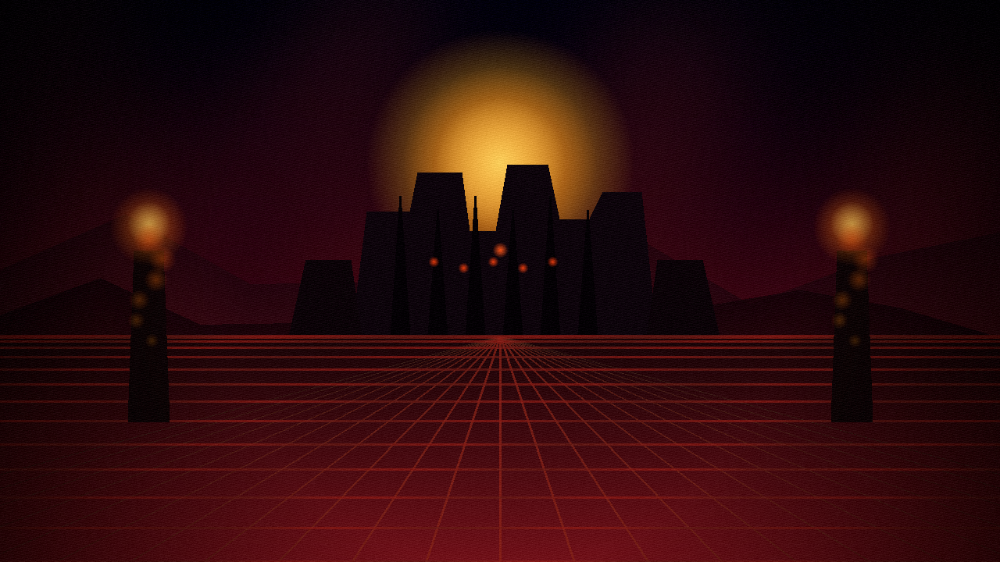

# DOOM — 3D

A retro-style Doom clone built entirely in the browser with React Three Fiber, Three.js, and Zustand.

Recently, I saw some one run Doom in pdf so just got my inspiration for 3-dimensional Doom in you browser.



Race through a demonic stronghold rendered with `react-three-fiber`, blast enemies at close range, and lean into a low-res browser FPS aesthetic.

**[Play the Demo](https://praneel23o-doom.netlify.app/)**

---

## Controls

| Action | Key / Input     |
|--------|-----------------|
| Move   | `W` `A` `S` `D` |
| Look   | Mouse           |
| Shoot  | `Spacebar`      |

## Getting Started

```bash
# Install dependencies
npm install

# Run locally
npm start
```


## Credits

Created by Praneel Singh for [HackClub](https://www.hackclub.com/).
